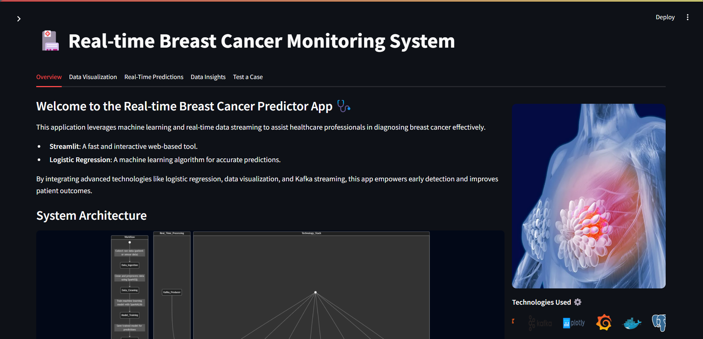
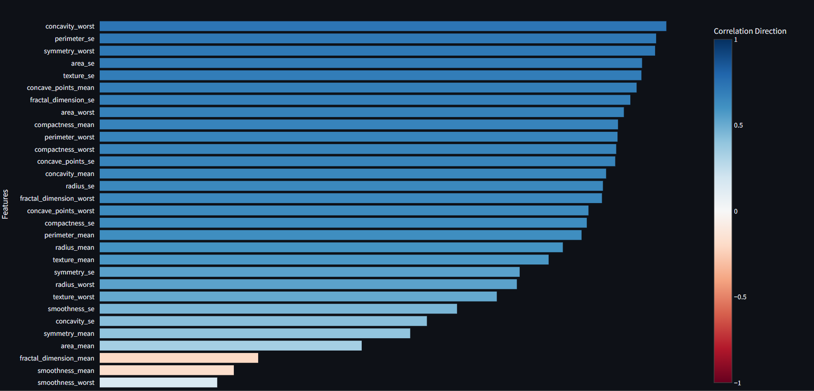
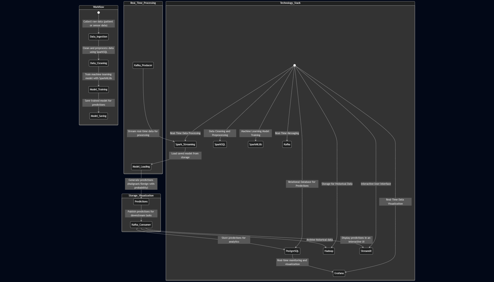
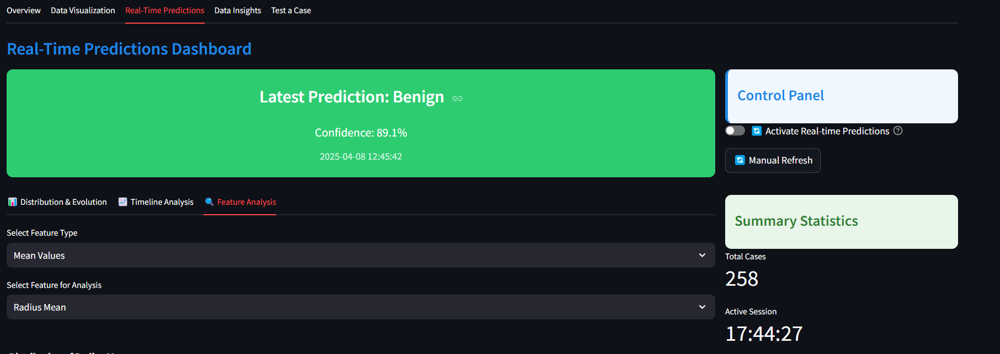
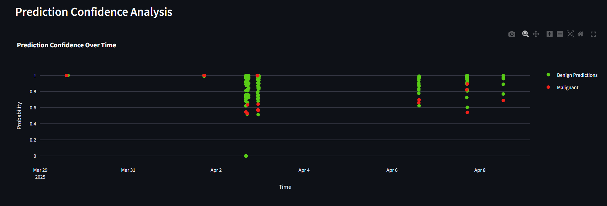
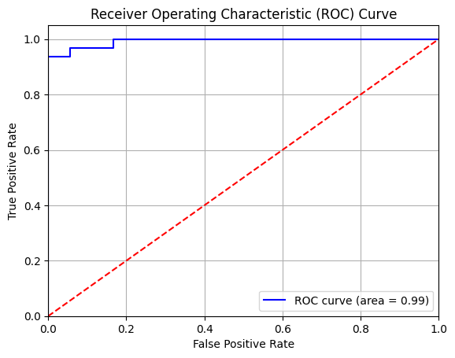

<div align="center">
  
  <h1>🏥 Real-time Breast Cancer Monitoring System</h1>
  <p>A cutting-edge ML-powered system for early cancer detection and real-time monitoring</p>

  <!-- Badges with modern design -->
  <p>
    
    
    
    
    
  </p>
</div>

## 🎬 Project Overview

<div align="center">
  <a href="https://www.youtube.com/watch?v=YOUR_VIDEO_ID">
    
  </a>
  <p><em>Click to watch the project overview video</em></p>
</div>

## ✨ Interactive Demo

<div align="center">
  <h3>Live System Demo For a Test Case's Tab</h3>
  <video width="800" controls loop autoplay>
    <source src="kafka_to_streamlit/images/breast-cancer.mp4" type="video/mp4">
  </video>
  <p><em>Real-time prediction and monitoring in action</em></p>
</div>

## 💫 Key Features

<div align="center">
  <table>
    <tr>
      <td align="center">
        
        <br /><strong>Interactive Dashboard</strong>
        <br />Real-time monitoring & visualization
        <br />
      </td>
      <td align="center">
        
        <br /><strong>Feature Importance</strong>
        <br />Key feature analysis & impact
        <br />
      </td>
      <td align="center">
        
        <br /><strong>Advanced Visualizations</strong>
        <br />3D plots & heatmaps
        <br />
      </td>
    </tr>
  </table>
</div>

## 🏗 System Architecture

<div align="center">
  
  <p><em>Comprehensive system architecture showing data flow and component interaction</em></p>
  
  <details>
    <summary>📝 Detailed Architecture Explanation</summary>
    <p>Detailed breakdown of each component and their interactions</p>
  </details>
</div>

## 📊 Data Flow

<div align="center">
  <h3>🔄 Real-time Data Processing Pipeline</h3>
  
  <p><em>Real-time data processing and prediction pipeline</em></p>
  
  <h3>⚡ System Features</h3>
  <table>
    <tr>
      <td align="center">
        
        <br /><strong>Real-time Monitoring</strong>
        <br />Live predictions & updates
      </td>
      <td align="center">
        
        <br /><strong>Latest Predictions</strong>
        <br />Instant results visualization
      </td>
      <td align="center">
      
        <br /><strong>Advanced Analytics</strong>
        <br />Detailed data insights
      </td>
    </tr>
  </table>
  
</div>

## 🛠️ Tech Stack

<div align="center">
  <table>
    <tr>
      <td align="center"><br />Python</td>
      <td align="center"><br />Hadoop</td>
      <td align="center"><br />Spark</td>
      <td align="center"><br />Kafka</td>
    </tr>
    <tr>
      <td align="center"><br />Streamlit</td>
      <td align="center"><br />Plotly</td>
      <td align="center"><br />PostgreSQL</td>
      <td align="center"><br />Grafana</td>
    </tr>
  </table>
</div>

## 🚀 Installation & Setup Guide

<div align="center">
  
</div>

### Prerequisites
```bash
Python 3.10+  |  Apache Hadoop 3.3+  |  Apache Kafka 2.8+  |  Apache Spark 3.0+
Streamlit 1.0+  |  Docker  |  PostgreSQL  |  Grafana
```

### Step-by-Step Setup

1. **Start Docker Containers**
```bash
# Start Hadoop containers
docker start hadoop-master hadoop-slave1

# Start Grafana container
docker start grafana
```

2. **Access Hadoop Master Container**
```bash
docker exec -it hadoop-master bash
```

3. **Start Hadoop and Kafka Services**
```bash
# Start Hadoop services
./start-hadoop.sh

# Start Kafka and Zookeeper
./start-kafka-zookeeper.sh
```

4. **Create Kafka Topics**
```bash
# Create prediction-topic
kafka-topics.sh --create --topic prediction-topic \
                --partitions 3 \
                --replication-factor 3 \
                --bootstrap-server localhost:9092

# Create prediction-results-topic
kafka-topics.sh --create --topic prediction-results-topic \
                --partitions 3 \
                --replication-factor 3 \
                --bootstrap-server localhost:9092

# Verify topics creation
kafka-topics.sh --list --bootstrap-server localhost:9092
```

5. **Install Python Dependencies**
```bash
pip install -r requirements.txt
```

6. **Start Spark Streaming**
```bash
# Navigate to project directory
cd /root/myproject/kafka_to_streamlit

# Submit Spark Streaming job
spark-submit --jars /root/myproject/postgresql-42.6.0.jar \
             --packages org.apache.spark:spark-sql-kafka-0-10_2.12:3.5.1 \
             SparkStreaming.py
```

7. **Launch Streamlit Application**
```bash
# In a new terminal
streamlit run App.py
```

### 🔍 Verification Steps

1. Check Hadoop services:
```bash
jps
```
Expected output should show: NameNode, DataNode, ResourceManager, etc.

2. Verify Kafka topics:
```bash
kafka-topics.sh --describe --bootstrap-server localhost:9092
```

3. Monitor Kafka topics:
```bash
# For prediction-topic
kafka-console-consumer.sh --bootstrap-server localhost:9092 \
                         --topic prediction-topic \
                         --from-beginning

# For prediction-results-topic
kafka-console-consumer.sh --bootstrap-server localhost:9092 \
                         --topic prediction-results-topic \
                         --from-beginning
```

### 📊 Accessing Services

- **Hadoop NameNode**: http://localhost:9870
- **YARN ResourceManager**: http://localhost:8088
- **Grafana Dashboard**: http://localhost:3000
- **Streamlit App**: http://localhost:8501

### ⚠️ Troubleshooting

If you encounter issues:

1. Check if all containers are running:
```bash
docker ps
```

2. Verify Kafka broker status:
```bash
kafka-broker-api-versions.sh --bootstrap-server localhost:9092
```

3. Check Kafka logs:
```bash
cat /var/log/kafka/server.log
```

4. Ensure proper permissions:
```bash
chmod +x start-hadoop.sh
chmod +x start-kafka-zookeeper.sh
```

## 📈 Performance Metrics

<div align="center">
  
  <p><em>System performance and accuracy metrics</em></p>
</div>

## 👨‍💻 Author

<div align="center">

  <h3>Aimad Bouya</h3>
  <p>AI & Data Enginnering Student</p>
</div>

## 📄 License
MIT License - See [LICENSE](LICENSE) for details

<div align="center">
  <br />
  <p>Made with ❤️ for better healthcare</p>
  <p>
    <a href="">
      
    </a>
    <a href="https://github.com/itsAimad">
      
    </a>
    <a href="[your-twitter]">
      
    </a>
  </p>
  
  <!-- Repository Stats -->
  <p>
    
    
    
    
  </p>

  <!-- Profile Views -->
  <p>
    
  </p>
</div> 


